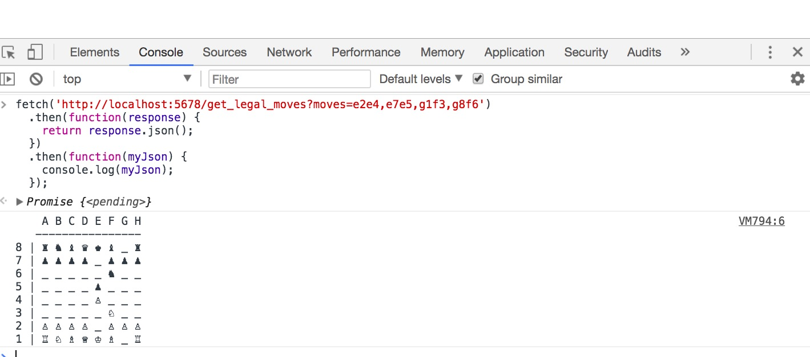

# chess_ai
Jack's Chess AI and Practice Software

## Testing Out Officiator.java
Steps to test Officiator API endpoint which passes move parameters and receives board state
1. OPEN Chrome with developer tools
2. Paste the following javascript into the console and hit return:

```javascript
fetch('http://localhost:5678/get_legal_moves?moves=e2e4,e7e5,g1f3,g8f6')
  .then(function(response) {
  	return response.json();
  })
  .then(function(myJson) {
    console.log(myJson);
  });
```

Voila here's what it should look like in your console: 
